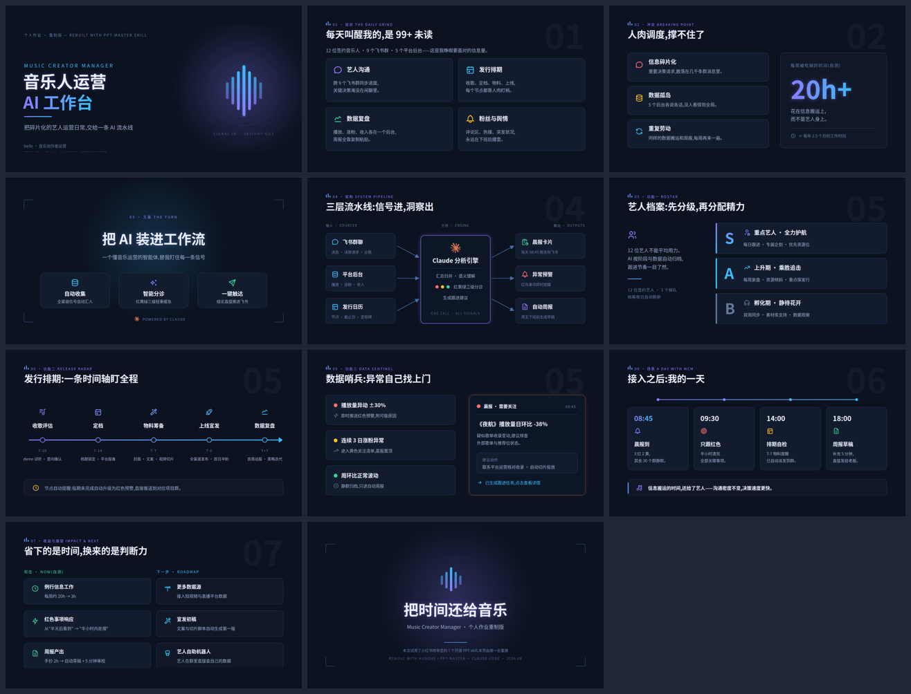

# Music Creator Manager — 作业重制版

用小红书榜单第一名的 [hugohe3/ppt-master](https://github.com/hugohe3/ppt-master) skill(Quick Generate 模式)重建的「Music Creator Manager」作业:一套 11 页、全原生可编辑的 PPTX,讲述把 AI 装进音乐人运营日常工作流的方案。



## 成品

| 文件 | 说明 |
|------|------|
| [`music-creator-manager.pptx`](music-creator-manager.pptx) | 最终成品(59KB)。11 页 16:9,文字/形状/图标全部是原生 DrawingML 对象,PowerPoint 里可直接改;中文字体导出为 Microsoft YaHei |
| [`svg/`](svg/) | 自包含 SVG(图标已内嵌),浏览器双击即可逐页预览 |
| [`svg-src/`](svg-src/) | 流水线源 SVG(含 `data-icon` 占位符),放回 ppt-master 项目目录可重新导出 |
| [`preview/`](preview/) | 页面截图与总览拼图 |

## 内容结构(narrative 叙事模式 × dark-tech 视觉风格)

1. **封面** — 音乐人运营 AI 工作台
2. **现状** — 12 位艺人、9 个群、5 个后台的信息洪流
3. **冲突** — 碎片化 / 数据孤岛 / 重复劳动,每周 20h+ 耗在搬运上
4. **方案** — 把 AI 装进工作流:自动收集 · 智能分诊 · 一键触达
5. **架构** — 飞书群聊 + 平台后台 + 发行日历 → Claude 分析引擎 → 晨报/预警/周报
6. **功能一 艺人档案** — S/A/B 分级,精力分配有据可依
7. **功能二 发行排期** — T-30 → T+7 一条时间轴盯全程,临期自动升级预警
8. **功能三 数据哨兵** — 红黄绿三级规则 + 晨报预警卡示例
9. **一天场景** — 08:45 晨报 → 09:30 只跟红色 → 14:00 排期自检 → 18:00 周报草稿
10. **收益与展望** — 时间收回来(自测数据),下一步接更多数据源/宣发初稿/艺人机器人
11. **结尾** — 把时间还给音乐

> 与本仓库的 Lark Daily Digest 一脉相承:红黄绿分诊的设计语言直接来自晨报卡片。文中数字为个人自测/示例,可在 PPT 里直接改。

## 复现步骤

```bash
bash skills/download_skills.sh                  # 下载 7 个 skill
cd ppt-skills/ppt-master
pip install python-pptx XlsxWriter skia-pathops uharfbuzz
python3 skills/ppt-master/scripts/project_manager.py init music-creator-manager --format ppt169 --quick-generate
python3 skills/ppt-master/scripts/icon_sync.py projects/music-creator-manager_* \
  tabler-outline/users tabler-outline/music tabler-outline/bell simple-icons/claude  # 等 30 个图标
cp <本目录>/svg-src/*.svg projects/music-creator-manager_*/svg_output/
python3 skills/ppt-master/scripts/svg_quality_checker.py projects/music-creator-manager_* --quick-generate --stage final --json
python3 skills/ppt-master/scripts/svg_to_pptx.py projects/music-creator-manager_* --quick-generate --no-notes
```

生成环境需要一个中文字体(SVG 里写的是 `Noto Sans CJK SC`,导出时会自动映射为 Microsoft YaHei)。
